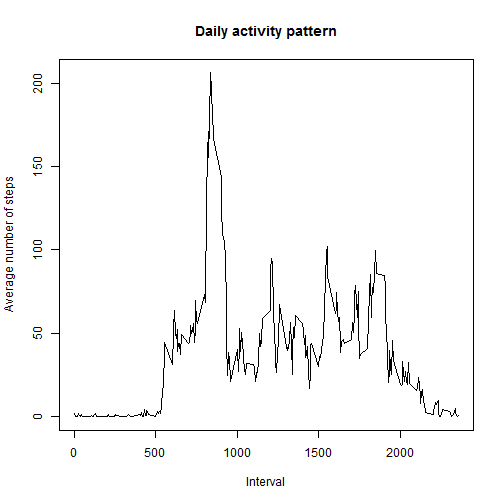
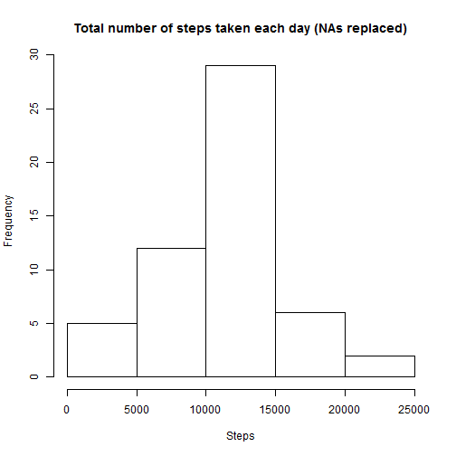

Reproducible Research - Peer Assessment 1
========================================================

### Total number of steps taken each day - Histogram

```r
unzip("activity.zip")
data <- read.csv("activity.csv")
subset <- subset(data, !is.na(data$steps))

totalStepsDay <- aggregate(steps~date, data=subset, FUN=sum)
hist(totalStepsDay$steps, main="Total number of steps taken each day", xlab="Steps")
```

 

```r
meanTotalStepsDay <- mean(totalStepsDay$steps)
medianTotalStepsDay <- median(totalStepsDay$steps)
```

### Number of steps taken each day - mean:

```r
meanTotalStepsDay
```

```
## [1] 10766
```

### Number of steps taken each day - median:

```r
medianTotalStepsDay
```

```
## [1] 10765
```

### Average number of steps taken ~ interval

```r
intervalMeanActivity <- aggregate(steps~interval, data=subset, FUN=mean)
plot(intervalMeanActivity$interval, intervalMeanActivity$steps, xlab="Interval", ylab="Average number of steps", main="Daily activity pattern", type="l")
```

 

```r
mostActiveInterval <- intervalMeanActivity$interval[which(intervalMeanActivity$steps==                 max(intervalMeanActivity$steps))]
```

### Five-minute interval that, on average, contains the maximum number of steps:

```r
mostActiveInterval
```

```
## [1] 835
```


### Number of NAs:

```r
sum(is.na(data$steps))
```

```
## [1] 2304
```

### Replacing NAs
There are lots of NAs in the original dataset. In the new dataset (see below), NAs were replaced by average number of steps (averaged across all days) for the corresponding interval. 


```r
dataNaReplaced <- data.frame(data)
dataNaReplaced$steps[is.na(dataNaReplaced$steps)] <- intervalMeanActivity$steps[which(is.na(dataNaReplaced$steps) & intervalMeanActivity$interval==dataNaReplaced$interval)]
totalStepsDayNaReplaced <- aggregate(steps~date, data=dataNaReplaced, FUN=sum)
```

### Total number of steps taken each day - Histogram - NAs replaced

```r
hist(totalStepsDayNaReplaced$steps, main="Total number of steps taken each day (NAs replaced)", xlab="Steps")
```

 

```r
meanTotalStepsDayNaReplaced <- mean(totalStepsDayNaReplaced$steps)
medianTotalStepsDayNaReplaced <- median(totalStepsDayNaReplaced$steps)
```

There is no difference between the means and only a sligtl difference between the medians.  


### Average number of steps per interval across weekdays and weekends

```r
Sys.setlocale("LC_TIME", "English") # needed to ensure we can compare results of weekdays() with english names of days of week; Windows only
```

```
## [1] "English_United States.1252"
```

```r
subset$typeOfDay <- as.factor(ifelse(weekdays(as.Date(subset$date)) %in% c("Saturday", "Sunday"), "Weekend", "Weekday"))
intervalMeanActivityWeekend <- aggregate(steps~interval, data=subset, FUN=mean, subset=subset$typeOfDay=="Weekend")
intervalMeanActivityWeekend$typeOfDay <- "Weekend"
intervalMeanActivityWeekday <- aggregate(steps~interval, data=subset, FUN=mean, subset=subset$typeOfDay=="Weekday")
intervalMeanActivityWeekday$typeOfDay <- "Weekday"
merged <- rbind(intervalMeanActivityWeekend,intervalMeanActivityWeekday)
library(lattice)
xyplot(merged$steps~merged$interval|merged$typeOfDay, type="l", layout=c(1,2), xlab="Interval", ylab="Number of steps")
```

 
